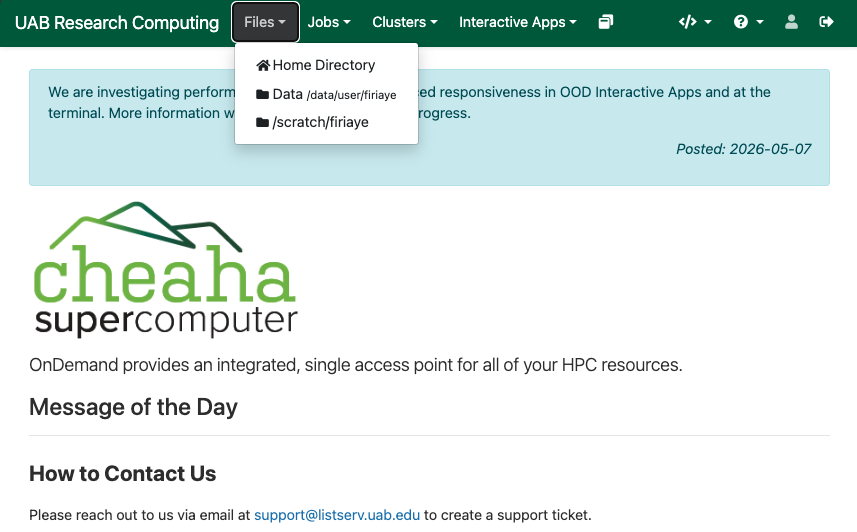
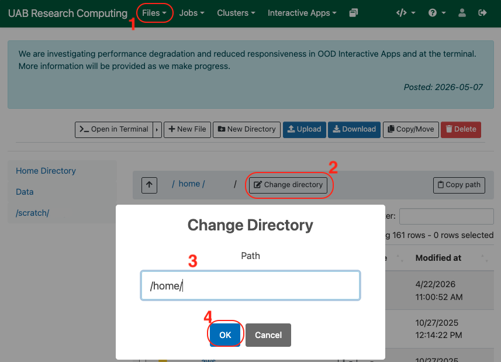
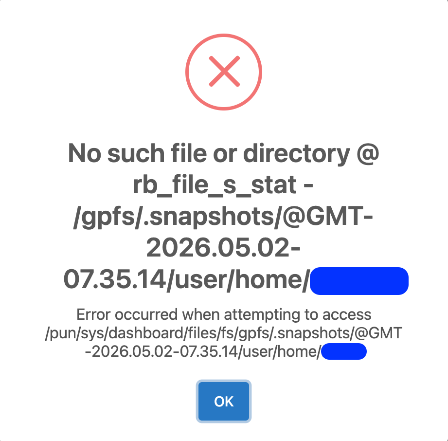
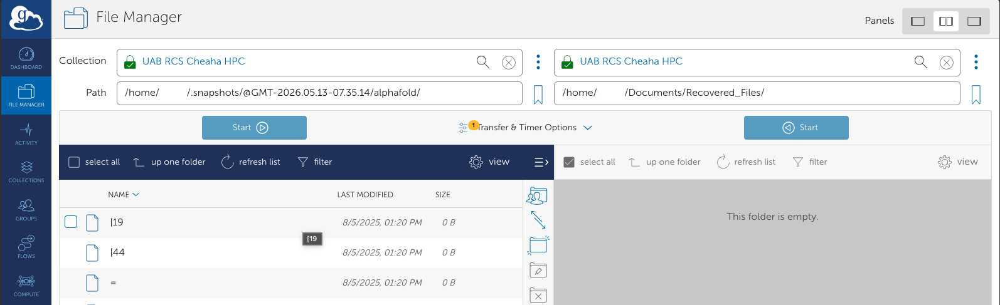

# Access GPFS Snapshots on Cheaha

How do you recover data that was deleted by mistake on the cluster? With our new GPFS filesystem, you can recover deleted files using GPFS Snapshots. GPFS Snapshots on Cheaha allow you to recover deleted or modified files without needing to contact Research Computing support. These Snapshots function similarly to tools like Time Machine on macOS or Timeshift on Linux, and are accessed directly through the filesystem.

## Overview

Snapshots are read-only, point-in-time copies of your directories (`$HOME`, `/data/user`, `/data/project`, `/scratch`) that are created automatically.

- Snapshots are created daily.
- Retains the most recent 14 days and the past 4 Saturdays.
- Snapshots for files from your `/home/$USER` are stored in the `/home/$USER/.snapshots` directory.
- Snapshots for files stored in `/data/user/$USER` are located in a hidden directory within the `/data/user/$USER/.snapshots` directory.
- Project directory Snapshots are located at `/data/project/<Project-Directory-Name>/.snapshots` within your project directory.
- Files in your scratch are also saved in a Snapshot directory located here `/scratch/$USER/.snapshots`.
- Files are restored by copying them out of the Snapshot directory. Use the `cp` command.
- Snapshots are a self-service recovery mechanism.
- Snapshots follow a timestamp based naming convention for saved directories. `snapshots_id = @GMT-YYYY.MM.DD-HH.MM.SS`. For example `@GMT-2026.04.23-07.35.14`.

<!-- markdownlint-disable MD046 -->
!!! note

    Snapshots provide short-term recovery only. For long-term backups, consider using [Long Term Storage (LTS)](../lts/index.md).
<!-- markdownlint-enable MD046 -->

## Accessing Snapshots via Open OnDemand (OOD)

Snapshots are accessible through the "Files" menu option on [Cheaha's Open OnDemand (OOD) landing page](https://rc.uab.edu). While it is possible to access Snapshots and recover your files this way, we strongly encourage users to use the methods discussed, using the [Terminal](#accessing-snapshots-via-the-terminal) or [Globus](#accessing-snapshots-via-globus) methods described in this guide.

You can access the Snapshots directory through OOD by entering the absolute path to the Snapshots directory for your `$HOME`, `data/user/$USER`, `/scratch/$USER` and your `/data/project/<project_directory>` location. On the OOD landing page, click the "Files" menu button. This should list available directory locations as dropdown menu options, such as your "Home Directory", "Data /data/user/`<yourBlazerID>`" and "/scratch/`<yourBlazerID>`" (In these examples `<BlazerID>` and `<project_directory>` are placeholders to represent your username and project directory names respectively). Selecting any of those options, will open a new window.



In the new window, you should see the "Change Directory" button. Clicking on this button, will open a menu box where you can enter a location path. Enter your desired location path, and click "OK" to change the directory to your desired location. In your Snapshots directory, you should see the available timestamped Snapshots directories listed.

To access your project directory Snapshots

```bash
data/project/<my_lab>/.snapshots/
```

To access your home directory Snapshots

```bash
/home/<$USER>/.snapshots/
```

To access your data/user directory Snapshots

```bash
/data/user/<$USER>/.snapshots/
```

To access your scratch directory Snapshots

```bash
/scratch/<$USER>/.snapshots/
```



<!-- markdownlint-disable MD046 -->
!!! important

    Remember to replace "my_lab" with the name of your project directory, and replace "$USER" with your BlazerID. These are placeholders in the above examples. Remember to also include the appropriate `<snapshots_id>` in the location path to access a specific Snapshot. If you attempt to access Snapshots within the `/gpfs` directory or input the wrong location path via the "Change Directory" OOD button, it will return an error.
<!-- markdownlint-enable MD046 -->



## Accessing Snapshots via the Terminal

### Open a Terminal

Access a terminal using one of the following methods:

- Launch an HPC Desktop session through [Open OnDemand](../../../cheaha/open_ondemand/hpc_desktop.md#accessing-the-terminal).
- [Connect via SSH to Cheaha](../../../cheaha/getting_started.md#accessing-cheaha).

### Navigating to Your Project, Home or User Snapshot Directory

Snapshots are available for files and directories in your home directory, user directory, scratch directory, and project directory. These files are located in `/home/$USER`, `/data/user/$USER`, `/scratch/$USER`, and `/data/project`. For all locations, snapshots are stored in a hidden directory named `.snapshots`. Although hidden files and directories can be listed by running the `ls -a` command within a directory, the `.snapshots` directory may not appear in the output. However, you can directly list it by using the absolute path to the `.snapshots` directory. This approach works with all locations.

For a project directory

```bash
ls -a /data/project/my_lab/.snapshots
```

For your home directory

```bash
ls -a /home/$USER/.snapshots
```

For your user directory, run.

```bash
ls -a /data/user/$USER/.snapshots
```

For your scratch directory

```bash
ls -a /scratch/$USER/.snapshots
```

This should list the contents of your `.snapshots` directory, including the available timestamped Snapshot directories. To go into the Snapshots located in your project, home, data/user or scratch directories, run the corresponding `cd` command. Remember to replace "my_lab" with the name of your project directory, and "snapshots_id" with the actual timestamped directory.

```bash
cd /data/project/my_lab/.snapshots/<snapshots_id>
```

To access your home directory run the command

```bash
cd /home/$USER/.snapshots/<snapshots_id>
```

To access your user directory run the command

```bash
cd /data/user/$USER/.snapshots/<snapshots_id>
```

To access your scratch directory run the command

```bash
cd /scratch/$USER/.snapshots/<snapshots_id>
```

<!-- markdownlint-disable MD046 -->
!!! note

    Files in your `/home/$USER` directory, are saved in the Snapshot directory located in `/home/$USER/.snapshots` for you to retrieve. They are also available here `/gpfs/.snapshots/<snapshots_id>/user/home/$USER`. Likewise for your `/data/user/$USER` files, you can also access them within the `gpfs` directory. Note, you will need to access them by going through the snapshots_id before accessing your files (i.e. `/gpfs/.snapshots/<snapshots_id>/user/$USER/`). This is a more indirect way to access these files, and is not recommended.
<!-- markdownlint-enable MD046 -->

### List Available Snapshots

Use the `ls` command within the `.snapshots` directory to view available Snapshots. Each directory is timestamped to show exactly when the files were saved.

```bash
ls
```


<!-- markdownlint-disable MD046 -->
!!! tip

    Choose a Snapshot created before the file was deleted or modified.
<!-- markdownlint-enable MD046 -->

### Enter a Snapshot Directory

Navigate into a Snapshot directory, using the `snapshots_id` listed in the `.snapshots` directory.

```bash
cd /path/to/files/in/snapshots/directory/<snapshots_id>
```

For instance, if you need to access files in your project directory (for example "my_lab") from April 23, 2026, those files can be accessed by running the command. Make sure the `snapshots_id` you enter falls within the 14 day period, and is listed as one of the available files in the Snapshot directory.

```bash
cd /data/project/my_lab/.snapshots/@GMT-2026.04.23-07.35.14
```

To access files located in your home directory Snapshot, you will run the below command (you can replace "$USER" with your BlazerID which doubles as your username).

```bash
cd /home/$USER/.snapshots/@GMT-2026.04.23-07.35.14
```

To access files located in your /data/user directory Snapshot, you will run the command.

```bash
cd /data/user/$USER/.snapshots/@GMT-2026.04.23-07.35.14
```

To access files located in your scratch directory Snapshot, you will run the below command (you can replace "$USER" with your BlazerID which doubles as your username).

```bash
cd /scratch/$USER/.snapshots/@GMT-2026.04.23-07.35.14
```

### Locate Your File

Browse the Snapshot as if it were your normal directory. So commands for file navigation like `ls` and `cd` will come in handy. You can review our [Using the Terminal](../../../cheaha/open_ondemand/hpc_desktop.md#using-the-terminal) section for additional information.

```bash
cd path/to/files/in/snapshot/directory

ls
```

Remember to replace the above path with the actual project directory, home or user directory path.

### Restore the File

To restore a file, copy it from the Snapshot directory into your preferred location outside the Snapshots directory with the `cp` command:

```bash
cp <source> <destination>

cp -r /data/project/.snapshots/<snapshots_id>/directoryORfilename /data/project/restoredDirectoryOrFilename
```

In the case of your home directory.

```bash
cp -r /home/$USER/.snapshots/<snapshots_id>/directoryORfilename /home/$USER/restoredDirectoryOrFilename
```

Or in the case of your user directory.

```bash
cp -r /data/user/$USER/.snapshots/<snapshots_id>/directoryORfilename /data/user/$USER/restoredDirectoryOrFilename
```

If the file to be restored is in your scratch directory.

```bash
cp -r /scratch/$USER/.snapshots/<snapshots_id>/directoryORfilename /home/$USER/restoredDirectoryOrFilename
```

<!-- markdownlint-disable MD046 -->
!!! important

    Snapshots are **read-only**. Files must be copied out (restored), before they can be used. Your files in the Snapshot directory may not reflect the actual file size until it is copied out.
<!-- markdownlint-enable MD046 -->

## Accessing Snapshots via Globus

Snapshots can also be accessed via the Globus web interface. If this is your first time using Globus, please review our [Globus tutorial](../../transfer/globus/login_to_globus.md) to familiarize yourself with the interface and how it is used.

Go to the [Globus Web App](../../transfer/globus/login_to_globus.md#how-do-i-get-onto-the-globus-web-app), and access a collection as shown in the tutorial for [transferring data between collections](../../transfer/globus/globus_individual_tutorial.md#how-do-i-transfer-data-between-collections). You will need to enter the correct file path for each file or directory you want to access, see the previous examples in [Accessing Snapshots via OOD](#accessing-snapshots-via-open-ondemand-ood) for reference.



## Common Mistakes

Avoid the following:

- Attempting to modify files inside `.snapshots` directory.
- Selecting a Snapshot created **after** the file was deleted.
- Using an incorrect directory path.
- Attempting to restore Ceph-stubbed files directly.

## When to Contact Support

Contact Research Computing if:

- You receive an **"Operation not permitted"** error.
- The file is not present in any Snapshot directory.
- You are unsure whether your data is GPFS or Ceph-resident.
- You need help restoring large or complex datasets.

For critical data that needs to be archived, consider using [Long Term Storage (LTS)](../lts/index.md), Snapshots are not intended for use as an archive.


