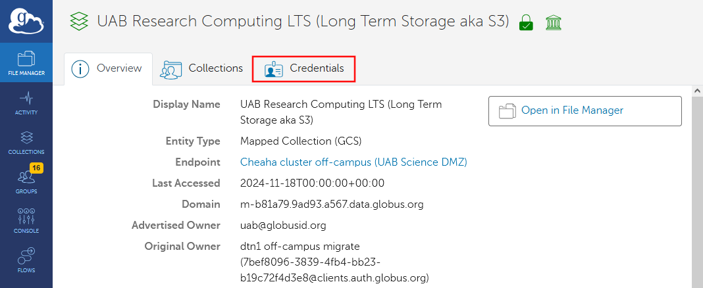
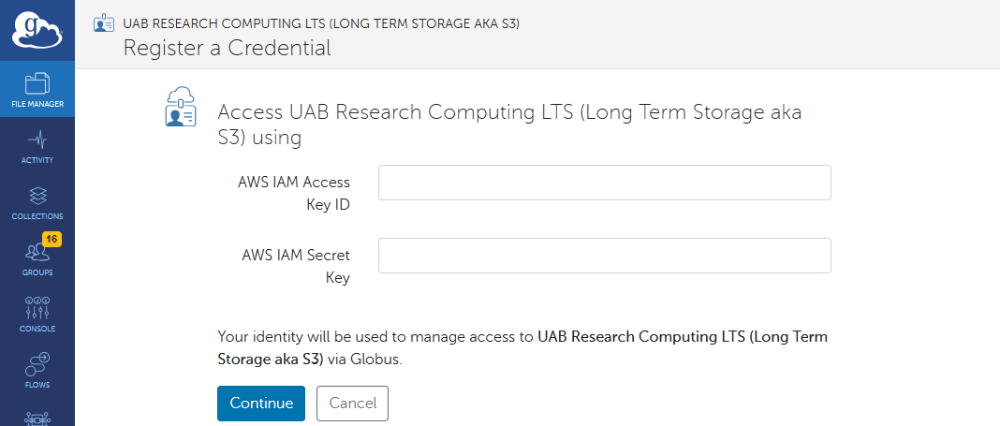
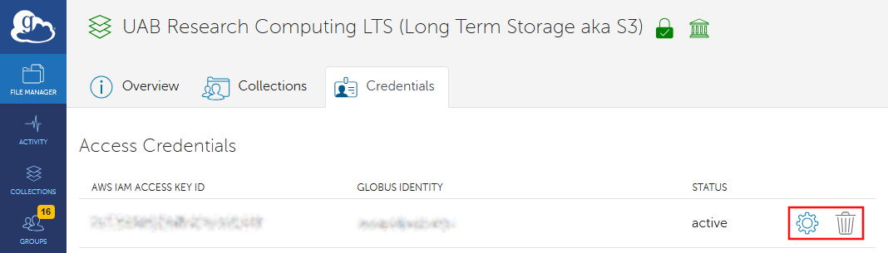

# Using Globus to Manage LTS Allocations

This tutorial is designed to guide UAB research managers, such as Lab PIs, Core Directors, and their management staff, in setting up and using Globus for secure data sharing and collaboration in conjunction with our [Long-Term Storage (LTS)](../lts/index.md) platform.

LTS has several moving parts and a command line interface (CLI), which can make working with it cumbersome for customers and collaborators whose skills may lie elsewhere. Globus provides features and a graphical user interface (GUI) that simpifies interacting with most of the features of LTS. Globus can make it much easier to collaborate on data or perform customer hand-offs.

If you are new to Globus or LTS, then there is no need to dive into those documentation pages right now. We have constructed these tutorials to distill only the knowledge you will need when using LTS with Globus.

Topics covered:

- [Why Use Globus to Manage LTS?](#why-use-globus-to-manage-lts)
- [Prerequisites](#prerequisites)
- [How Do I Prepare to Use LTS in Globus?](#how-do-i-prepare-to-use-lts-in-globus)
- [How Do I Configure My LTS Keys in Globus?](#how-do-i-configure-my-lts-access-keys-in-globus)
- [How Do I Create a Bucket?](#how-do-i-create-a-bucket)
- [How Do I Create a Folder in a Bucket?](#how-do-i-create-a-folder-in-a-bucket)
- [How Do I Share a Bucket or Folder as a Guest Collection?](#how-do-i-share-a-bucket-or-folder-as-a-guest-collection)
- [How Do I Transfer Data to and From Cheaha?](#how-do-i-transfer-data-to-and-from-cheaha)
- [How Do I Manage Bucket Policies?](#how-do-i-manage-bucket-policies)

## Why Use Globus to Manage LTS?

Read more about [How Globus Works](../transfer/tutorial/globus_organization_tutorial.md#how-does-globus-work).

## Prerequisites

Before using any of these tutorials, you will need to set up an [Individual LTS Allocation](../index.md#how-do-i-request-individual-long-term-storage). If you represent a group such as a Lab or Research Core, you will also need to set up a [Shared LTS Allocation](../index.md#how-do-i-request-shared-storage).

Be sure to keep track of your Access and Secret keys as you receive them. These should be treated like a username and password. See [What are Access and Secret Keys?](../lts/lts_faq.md#what-are-access-and-secret-keys).

## How Do I Prepare to Use LTS in Globus?

1. [Get Onto the Globus Web App](../transfer/tutorial/globus_individual_tutorial.md#how-do-i-get-onto-the-globus-web-app).
1. [Configure your LTS Access Keys](#how-do-i-configure-my-lts-access-keys-in-globus), unless you have already done so.
1. [Find the LTS Collection in the File Manager](../transfer/tutorial/globus_individual_tutorial.md#how-do-i-find-uab-storage-mapped-collections).

## How Do I Configure My LTS Access Keys in Globus?

Be mindful that you may have multiple sets of keys, one for each role and storage allocation you have. These may include one or more of the following.

- Individual allocation
- Shared lab allocation
- Shared Core allocation

Please use the appropriate keys for the group you are managing. It is rare for an individual to need to share data from their individual allocation, so that is likely not the set of keys you need.

<!-- markdownlint-disable MD046 -->
!!! note

    We are aware of the need to switch between keys when managing both a lab and a Core. In the future we plan to create three LTS Mapped Collections with appropriate names. You will be able to configure each set of keys in the appropriate Collection, which should create a smoother experience.
<!-- markdownlint-enable MD046 -->

1. [Get Onto the Globus Web App](../transfer/tutorial/globus_individual_tutorial.md#how-do-i-get-onto-the-globus-web-app).
1. [Find the UAB LTS Collection](../transfer/tutorial/globus_individual_tutorial.md#how-do-i-find-uab-storage-mapped-collections).
1. Click the "Credentials" tab in the Collection details page, highlighted in the screenshot below.

    

1. Enter your [UAB LTS Access Key and Secret Key](../lts/lts_faq.md#what-are-access-and-secret-keys) here. If you are working to configure [Guest Collections](../transfer/tutorial/globus_organization_tutorial.md#how-do-i-create-a-guest-collection) for a Shared LTS allocation, such as for a Lab or Research Core, then you will need to enter the shared allocation keys of your individual allocation keys.

    

1. If the keys have been entered successfully you will be redirected to the UAB LTS Collection details page on the "Credentials" tab. There will be a new entry in the "Access Credentials" space. You should see the same Access Key you entered.

    - To delete the keys, click the "trash can" icon.
    - To update the keys, click the "gear" icon.

    <!-- markdownlint-disable MD046 -->
    !!! important

        At this time, you can only have keys for one allocation active at a time in the UAB LTS Collection. To manage a different LTS allocation using Globus, you will need to delete the existing keys at this page and enter new keys.
    <!-- markdownlint-enable MD046 -->

    

## How Do I Create a Bucket?

The concept of [buckets](../lts/index.md#terminology) is specific to LTS and its S3 backend. Don't worry if you don't know those terms. You can treat buckets as a kind of special top-level folder or directory. WHen you create a folder in the root of your LTS allocation, a bucket will be created in LTS. There are some special naming rules, which are noted in the instructions below.

1. [Prepare to Use LTS in Globus](#how-do-i-prepare-to-use-lts-in-globus).
1. [Create a New Folder](../transfer/tutorial/globus_individual_tutorial.md#how-do-i-modify-files-and-folders).
    - Folders created at the root level of your LTS allocation become buckets, so you will need to be mindful of [LTS Bucket Name Rules](../lts/lts_faq.md#what-are-valid-bucket-names-in-lts) when choosing a name. This is link is _very_ helpful, please read it!
    - Bucket folders behave like any other folders when transferred with Globus.
    - [Folders created inside buckets](#how-do-i-create-a-folder-in-a-bucket) behave like regular folders when using the Globus interface.

        <!-- markdownlint-disable MD046 -->
        !!! info

            Folders in LTS are implemented differently from traditional filesystems, but this should not impact how you use Globus. If you are interested in learning more, see [How Do Folders Work in LTS and S3?](../lts/lts_faq.md#how-do-folders-work-in-lts-and-s3).
        <!-- markdownlint-enable MD046 -->

## How Do I Create a Folder in a Bucket?

1. [Prepare to Use LTS in Globus](#how-do-i-prepare-to-use-lts-in-globus).
1. [Open](../transfer/tutorial/globus_individual_tutorial.md#how-do-i-use-the-file-manager-page) the bucket where you want to create a folder.
1. Click the [Create New Folder button](../transfer/tutorial/globus_individual_tutorial.md#how-do-i-modify-files-and-folders) to create a new folder.

<!-- markdownlint-disable MD046 -->
!!! info

    Folders in LTS are implemented differently from traditional filesystemsm, but this should not impact how you use Globus. If you are interested in learning more, see [How Do Folders Work in LTS and S3?](../lts/lts_faq.md#how-do-folders-work-in-lts-and-s3).
<!-- markdownlint-enable MD046 -->

## How Do I Share a Bucket or Folder as a Guest Collection?

1. [Prepare to Use LTS in Globus](#how-do-i-prepare-to-use-lts-in-globus).
1. [Create a Guest Collection](../transfer/tutorial/globus_organization_tutorial.md#how-do-i-create-a-guest-collection) from the bucket or folder.
1. [Share the Guest Collection](../transfer/tutorial/globus_organization_tutorial.md#how-do-i-share-a-guest-collection-with-others) with the individuals or groups you wish to share with.

## How Do I Transfer Data to and From Cheaha?

See [How Do I Transfer Between LTS and Cheaha](../transfer/tutorial/globus_individual_tutorial.md#how-do-i-transfer-between-lts-and-cheaha).

## How Do I Manage Bucket Policies?

Globus has no concept of, nor interface for, managing bucket policies. Iinstead, sharing is done using [Guest Collections](#how-do-i-share-a-bucket-or-folder-as-a-guest-collection).

A Collection can be thought of as a gateway. The gateway is prepared in advance with your credentials. Then, you choose who you want to have access to your data through that gateway. Data is then shared seamlessly on your behalf, as though the collaborator had authorization to access the data on that system. Note that means you are now responsible for granting the collaborator authorization, so be mindful of who you share data with.

<!-- markdownlint-disable MD046 -->
!!! info

    Buckets in Globus have no policy applied and the most restrictive access controls possible. If you want to allow others to access the bucket outside of Globus, you will still need to use [policies](../lts/iam_and_policies.md#bucket-policies)
<!-- markdownlint-enable MD046 -->

For Cores and other organizations with customers, sharing LTS through Collections means your customers, and most of your staff, do not have to work with LTS directly.
